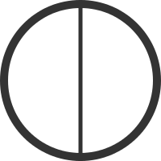

The Werld
==========================

Daniil Kharms

---

> I told myself that I see the world.

> But the whole world was not accessible to my gaze, and I saw only parts of the world.

---

> And everything that I saw I called parts of the world.

> And I examined the properties of these parts and, examining these properties,

> I wrought science.

---

> I understood that the parts have _intelligent_ properties and
> _unintelligent_ properties. I distinguished them and gave them
> names. And, depending on their properties, the parts of the
> world were _intelligent_ or _unintelligent_.

---

> And there were such parts of the world which could think.

---

> And these parts looked upon me and upon the other parts.

---

> And all these parts resembled one another, and I resembled them.
> And I spoke with these parts.

---

> I said: parts thunder.

> The parts said: a clump of time.

---

> I said: I am also part of the three turns.

> The parts answered: And we are little dots.

---

> And suddenly I ceased seeing them and, soon after, the other parts as well

> And I was frightened that the world would collapse.

---

> But then I understood that I do not see the parts independently, but I see it all at once.

> At first I thought that it was NOTHING. But then I understood that this was the world
> and what I had seen before was NOT the world.

---

> And I had always known what the world was, but what I had seen before I do not know even now.

---

> And when the parts disappeared their _intelligent_ properties
> ceased being _intelligent_, and their _unintelligent_
> properties ceased being _unintelligent_.

---

> And the whole world ceased to be _intelligent_ and _unintelligent_.

---

> But as soon as I understood that I saw the world, I ceased seeing it.

> I became frightened, thinking that the world had collapsed.

> But while I was thinking this, I realized that had the world collapsed
> then I would already not be thinking this.

---

> And I watched, looking for the world, but not finding it.

---

> And soon after there wasn't anywhere to look.

---

...

---

> Then I realized that since before there was somewhere to look&mdash;there had been a world around me.

---

> And now it's gone. There's only me.

---

> And then I realized that I am the world.
> But the world&mdash;is not me.

---

> Although at the same time I am the world.
> But the world's not me.

---

> And I'm the world.
> But the world's not me.

---

> And I'm the world.

> But the world's not me.

---

> And I'm the world.

---

> And after that I didn't think anything more.

---

_May 30, 1930_ 

_Daniil Kharms_
===============
